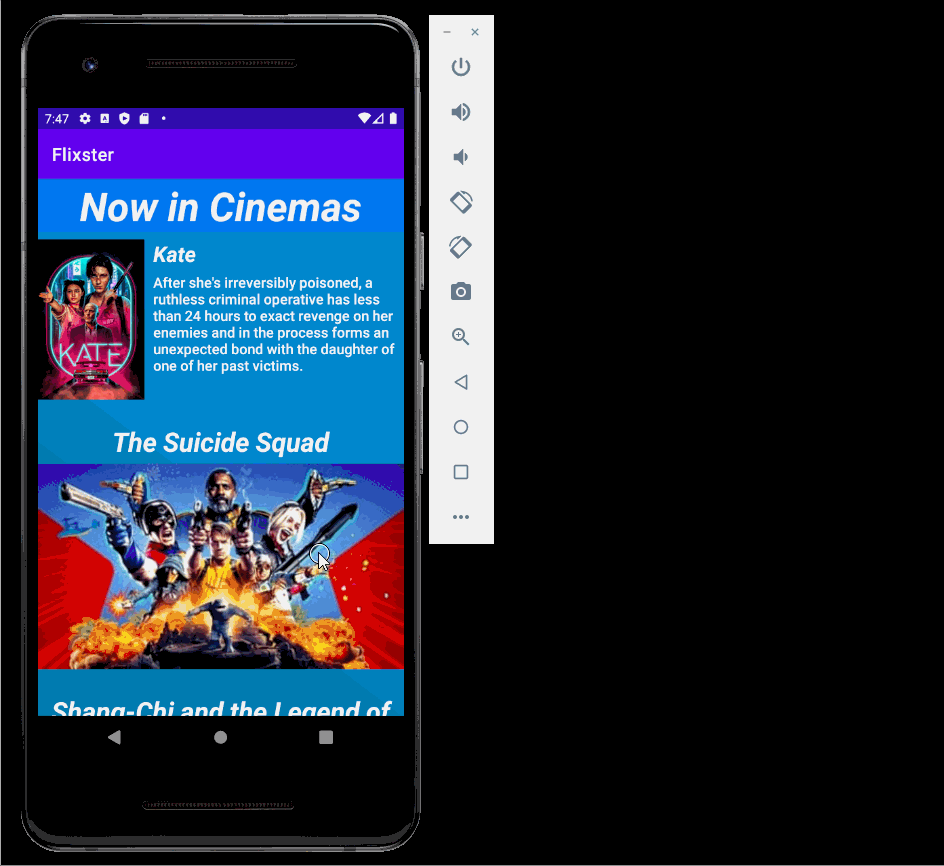
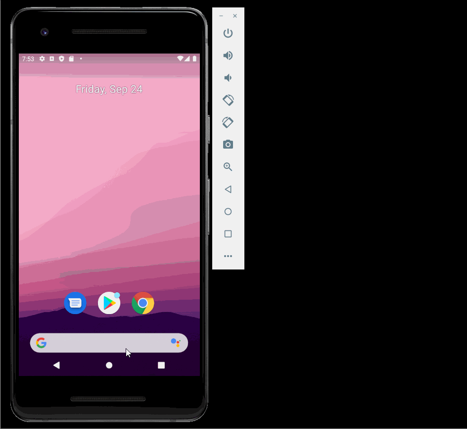
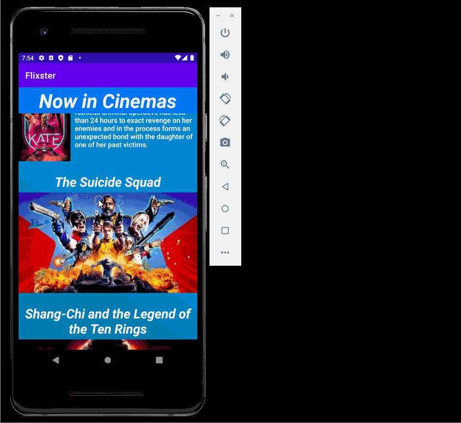

# Flix
Flix is an app that allows users to browse movies from the [The Movie Database API](http://docs.themoviedb.apiary.io/#).

📝 `NOTE - PASTE PART 2 SNIPPET HERE:` Paste the README template for part 2 of this assignment here at the top. This will show a history of your development process, which users stories you completed and how your app looked and functioned at each step.

---

## Flix Part 1

### User Stories

#### REQUIRED (10pts)
- [x] (10pts) User can view a list of movies (title, poster image, and overview) currently playing in theaters from the Movie Database API.

#### BONUS
- [x] (2pts) Views should be responsive for both landscape/portrait mode.
   - [x] (1pt) In portrait mode, the poster image, title, and movie overview is shown.
   - [x] (1pt) In landscape mode, the rotated alternate layout should use the backdrop image instead and show the title and movie overview to the right of it.

- [x] (2pts) Display a nice default [placeholder graphic](https://guides.codepath.org/android/Displaying-Images-with-the-Glide-Library#advanced-usage) for each image during loading
- [x] (2pts) Improved the user interface by experimenting with styling and coloring.
   - [x]    Added Linear Gradient Background through Additional drawable resource file
   - [x]    Added non-scrolling "Now Showing" Heading to top of UI
   - [x]    Changed Text colours and font for better visibility and impact
   - [x]    Added padding between list items for a better organised feel

- [x] (2pts) For popular movies (i.e. a movie voted for more than 5 stars), the full backdrop image is displayed. Otherwise, a poster image, the movie title, and overview is listed. Use Heterogenous RecyclerViews and use different ViewHolder layout files for popular movies and less popular ones.

### App Walkthough GIF

Main Walkthrough GIF - Runs through usage of application and shows the User-interface

 

Orientation Response - Shows the change in less popular movie image displays upon orientation change. The poster image is shown in the portrait orientation and teh backdrop image is shown in the landscape orientation with text on the right in both.

 

Network Speed Placeholder - Shows the use of a placeholder graphic while teh movie image loads.

 

Heterogeneous RecyclerView - Shows the change in display style for popular and less popular movies. Popular movies with ratings of above 7 are shown with just their Title and Backdrop image in both orientations whereas less popular movies are displayed with poster image, title and overview in portrait or backdrop image, title and overview in landscape.

 

### Notes
I had the most issues with the heterogenous recycler views as I initially used the the viewholder I defined for teh initial application's onCreate method. This caused errors in casting to a different viewholder type. Apart from that, I had some minor issues fetching and separating data from the Database as I had trouble deciphering teh returned key value pairs and had to go over the results for atleast 30 minutes to undertstand the various components and data values returned and thus debug my code.

### Open-source libraries used

- [Android Async HTTP](https://github.com/codepath/CPAsyncHttpClient) - Simple asynchronous HTTP requests with JSON parsing
- [Glide](https://github.com/bumptech/glide) - Image loading and caching library for Androids
